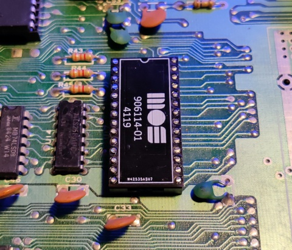

PLA replacement circuit for Commodore 64.
Based on dodgyPLA https://github.com/desaster/c64-dodgypla

I showed the design to some friends and they said "neat". Hence the name neatPLA :)

What is changed compared to dodgyPLA:
- 3.6V voltage regulator. Better for logic levels. Still within XC9536XL specs
- Cool looking PCB
- Changed pin mapping code to mach the new schematic & PCB.
- CASRAM delay increased to 30ns. Fixes timing issues with motherboard 326298
- Added extra delay to all outputs. Fixes a timing issue with motherboard 250425 + SwinSID

Now it is one of the most compatible PLA replacements.

This project includes:
* A Xilinx ISE project written in Verilog for Xilinx XC9536XL
* .jed file for programming the CPLD chip
* Gerber design files for ordering your own PCBs
* Schematic PDF

To be added:
* Bill of materials
* links to parts
* link to PCBway for PCB order

If you want a ready assembled PCB check my Amibay sales posts TBD.
I charge 14€ + shipping for it.

Parts for DIY can be as low as 3$ per assembled board.
