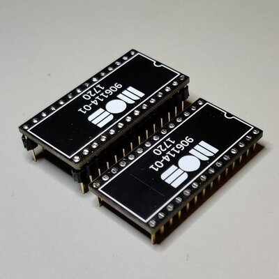

PLA replacement circuit for Commodore 64.
Based on dodgyPLA https://github.com/desaster/c64-dodgypla

    

I showed the design to some friends and they said "neat". Hence the name neatPLA :)

What is changed compared to dodgyPLA:
- 3.6V voltage regulator. Better for logic levels. Still within XC9536XL specs
- Cool looking PCB
- Changed pin mapping code to mach the new schematic & PCB.
- CASRAM delay increased to 30ns. Fixes timing issues with motherboard 326298
- Added extra delay to all outputs. Fixes a timing issue with motherboard 250425 + SwinSID

Now it is one of the most compatible PLA replacements.

This project includes:
* A Xilinx ISE project written in Verilog for Xilinx XC9536XL
* A Xilinx iMPACT project file (I use this SW and Xilinx Platform cable USB for programming)
* .jed and .svf file for programming the CPLD chip (subfolder _original_dodgyPLA_fix_ got fixed files for the original dodgyPLA and compatible versions)
* Gerber design files for ordering your own PCBs
* BOM and CPL files for SMD assembly service
* Schematic PDF

Part list:
| Definition                                 | Designator | Quantity | Manufacturer              | Manufacturer PN   | Alternative                              |
| ------------------------------------------ | ---------- | -------- | ------------------------- | ----------------- | ---------------------------------------- |
| CAP CER 2.2uF 16V X7R 0805                 | C1, C2     | 2        | Samsung Electro-Mechanics | CL21B225KOFNNNE   | Any 2.2uF 16V X7R 0805 ceramic capacitor |
| CAP CER 220nF 50V X7R 0805                 | C3         | 1        | Samsung Electro-Mechanics | CL21B224KBFNNNE   | Any 220nF 50V X7R 0805 ceramic capacitor |
| IC CPLD 36MC 10NS 44VQFP                   | U1         | 1        | AMD                       | XC9536XL-10VQG44C | XC9536XL-10VQG44I                        |
| IC REG LIN 3.6V 250MA SOT23-3              | U2         | 1        | Microchip Technology      | MCP1702T-3602E/CB | MCP1700T-3602E/TT                        |
| CONN HEADER 2.54MM MALE-MALE ROUND 14 PINS | J1         | 1        | \-                        | \-                | long leg female headers                  |
| CONN HEADER 2.54MM MALE-MALE ROUND 14 PINS | J2         | 1        | \-                        | \-                | long leg female headers                  |
| PCB                                        | \-         | 1        | JLCpcb / PCBway           | \-                |                                          |

Long leg female headers makes a lower profile but are only compatible with leaf spring sockets. Round pin headers gives a taller profile but are compatible with all sockets.

    
    

 

PCBs can be ordered with the provided gerber files.
You can also buy the PCBs from [PCBway](https://www.pcbway.com/project/shareproject/neatPLA_for_Commodore_64.html).

If you want a ready assembled PCB check my [Amibay sales posts](http://www.amibay.com/showthread.php?111794-neatPLA-The-best-looking-PLA-for-fixing-your-C64-). I charge 17€ + shipping for it.

[Programming guide for cheap FT232H board](https://github.com/1c3d1v3r/neatPLA/tree/master/programming)
